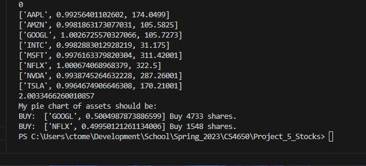
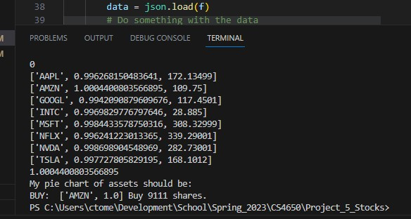
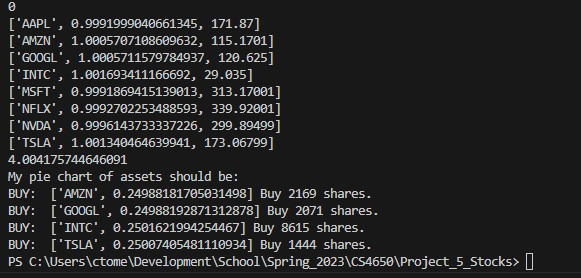
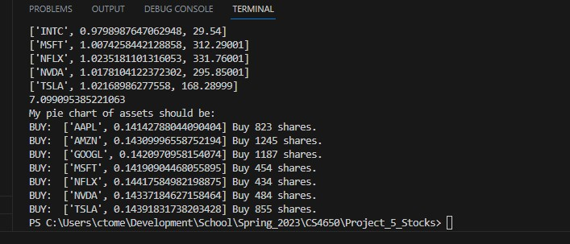
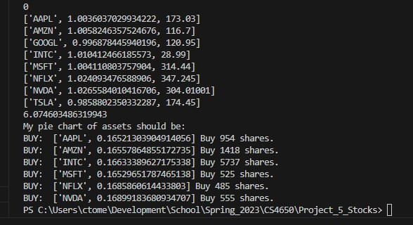
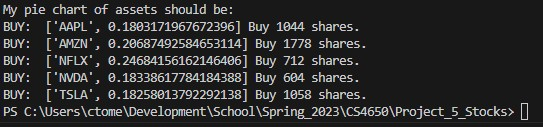
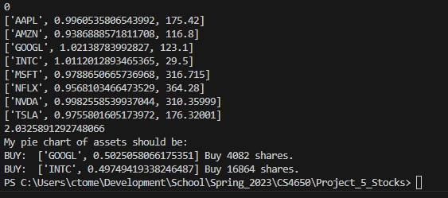

### Tomes, Christopher
### CS4650 Big Data and Cloud Computing
### Cal Poly Pomona

### Github: https://github.com/Ctomes/Project_5_Stocks
### Youtube Video: https://youtu.be/8mYGxZ74g8c

### Final Score:


These were screenshots of all of my predictions:










## This Notebook will show the process I used to build a program that creates Stock Predictions.

### The stocks considered: "AAPL","AMZN","GOOGL","MSFT","NFLX","TSLA","NVDA","INTC"


## Gather Data:
To make a prediction we are going to use a few datasets: Historic Stock Information, Twitter Engagement, Google Trends, and Other Stock Dependencies. 

# Historic Stock Information Gathering:


```python
import requests
import json
import os
```

Stock Information is available through many databases and services. 
For this assignment I decided to use TwelveData which offers a free tier for their Stock API which is updated in realtime. 
You will need to create an account and recieve an API key.


```python

# api key is stored in file: 'api_key.txt'
api_key = ""

with open("api_key.txt", 'r') as file:
    api_key = file.readline().strip()

# Time to start collecting information from: 
start_date = "04/01/2023 8:00 PM"

# The model will predict the price of stock based on one interval forward. 
# Supports: 1min, 5min, 15min, 30min, 45min, 1h, 2h, 4h, 1day, 1week, 1month
interval = "4h"

# Stocks to train on:
tickers = {"AAPL","AMZN","GOOGL","MSFT","NFLX","TSLA","NVDA","INTC"}
```

We will now query the API and store the data into text files for later referal. 


```python
print('Requesting Data:')
for ticker in tickers:
    url = f"https://api.twelvedata.com/time_series?symbol={ticker}&interval={interval}&format=JSON&start_date={start_date}&apikey={api_key}"
    response = requests.get(url)
    if response.status_code == 200:
        data = response.json()
        filename = f"{ticker}.json"
        filepath = os.path.join("nb_stock_data", filename)
        with open(filepath, "w") as f:
            json.dump(data, f)
        print(f"JSON data saved to file {filepath}!")
    else:
        print("Request failed with status code:", response.status_code)
        break;
print('Loop Complete')    
```

    Requesting Data:
    JSON data saved to file notebook_stock_data\MSFT.json!
    JSON data saved to file notebook_stock_data\AMZN.json!
    JSON data saved to file notebook_stock_data\GOOGL.json!
    JSON data saved to file notebook_stock_data\TSLA.json!
    JSON data saved to file notebook_stock_data\INTC.json!
    JSON data saved to file notebook_stock_data\AAPL.json!
    JSON data saved to file notebook_stock_data\NFLX.json!
    JSON data saved to file notebook_stock_data\NVDA.json!
    Loop Complete
    

# Gathering Twitter Engagement

The module used for this part is snscrape. It is a scraper for social networking services and we will be using their TwitterSearchScraper to gather Tweet data.


```python
# importing libraries and packages
import snscrape.modules.twitter as sntwitter
import pandas as pd
pd.options.mode.chained_assignment = None  # default='warn'
```


```python
#Create a dictionary relating each Ticker to Twitter username:
stocks = {"AAPL": "Apple","AMZN": "amazon","GOOGL": "Google","MSFT": "Microsoft","NFLX": "netflix","TSLA": "Tesla","NVDA": "nvidia","INTC" : "intel"}

# Creating list to append tweet data 
tweets_list1 = []
for stock in stocks:
   print(stocks[stock])

   if stocks[stock] == 'Apple':
      #For AAPL: Apple account doesn't tweet, they will recieve a default value for now.
      continue

# Using TwitterSearchScraper to scrape each account's tweets and append to list
   for i,tweet in enumerate(sntwitter.TwitterSearchScraper('from:'+stocks[stock]).get_items()):

      if i>100: # Number of tweets to store
         break
      # Declare the attributes to be returned
      tweets_list1.append([stock,tweet.date, tweet.id, tweet.rawContent, tweet.replyCount, tweet.likeCount, tweet.quoteCount, tweet.viewCount, tweet.vibe, tweet.retweetCount, tweet.conversationId]) 

    
# Create a Dataframe from the tweets list above 
tweets_df1 = pd.DataFrame(tweets_list1, columns=['STOCK', 'Datetime', 'Tweet Id', 'Text', 'Reply Count', 'Like Count', 'Quote Count', 'View Count', 'Vibe', 'Retweet Count', "Conversation Id"])

filename = "tweets_nb.csv"
tweets_df1.to_csv(filename)
```

    Apple
    amazon
    Google
    Microsoft
    netflix
    Tesla
    

    Could not translate t.co card URL on tweet 1648805800092073986
    

    nvidia
    intel
    

# Process and Clean Twitter Data
Clean the data, remove uneccessary columns, and calculate our own metric to determine a good/bad tweet.


```python
# Load the CSV file into a DataFrame
df = pd.read_csv('tweets_nb.csv')

columns_to_remove = ['Tweet Id', 'Text', 'Quote Count','Vibe', 'Retweet Count', 'Conversation Id', 'Reply Count']

# Drop the unnamed index column and other unecessary columns
df = df.iloc[:, 1:]
df = df.drop(columns_to_remove, axis=1)

# Get the unique values from the first column
unique_values = df['STOCK'].unique()

# Create a dictionary to store the split DataFrames
dfs = {}

# Split the DataFrame based on unique values in the first column
for value in unique_values:
    dfs[value] = df[df['STOCK'] == value].copy()


# Create the directory if it doesn't exist
os.makedirs("nb_twitter_data", exist_ok=True)

# Access the split DataFrames using the unique values
for value, split_df in dfs.items():
    try:


        # Remove nulls
        dfs[value] = dfs[value].dropna()
        
        #group by day.
        dfs[value]['date'] = pd.to_datetime(split_df['Datetime']).dt.date
        dfs[value] = dfs[value].groupby('date').sum(['Like Count', 'View Count', 'Engagement Score'])

        #Calculate the Engagement for any particular day.
        dfs[value]['Engagement Score']  = dfs[value]['Like Count'] / dfs[value]['View Count']
        dfs[value]['Engagement Score']  = dfs[value]['Engagement Score'] - dfs[value]['Engagement Score'].median()

        print(f"DataFrame for {value}:")
        print(dfs[value])

        # Store to CSV 
        filename = (f"{value}.csv")
        filepath = os.path.join("nb_twitter_data", filename)
        dfs[value].to_csv(filepath)
    except Exception as e:
        print(f"An error occurred while writing CSV file for '{value}': {str(e)}")

```

    DataFrame for AMZN:
                Like Count  View Count  Engagement Score
    date                                                
    2023-05-15         596    175266.0          0.000421
    2023-05-16         182    106802.0         -0.001275
    2023-05-17         257    167267.0         -0.001443
    2023-05-18        1350    431495.0          0.000149
    2023-05-19         140     46990.0          0.000000
    DataFrame for GOOGL:
                Like Count  View Count  Engagement Score
    date                                                
    2023-05-18        2129    853940.0          0.000000
    2023-05-19        1890    698404.0          0.000213
    2023-05-20           0        28.0         -0.002493
    DataFrame for MSFT:
                Like Count  View Count  Engagement Score
    date                                                
    2023-05-05         603    214130.0          0.000000
    2023-05-08         721    348736.0         -0.000749
    2023-05-09         431    213213.0         -0.000795
    2023-05-10           5      1703.0          0.000120
    2023-05-11         266    142458.0         -0.000949
    2023-05-12        1437    588156.0         -0.000373
    2023-05-13        1101    318482.0          0.000641
    2023-05-14        2079    397149.0          0.002419
    2023-05-15       49819   6567274.0          0.004770
    2023-05-16        1781    620459.0          0.000054
    2023-05-17         489    247422.0         -0.000840
    2023-05-18        1292    533145.0         -0.000393
    2023-05-19         692    235799.0          0.000119
    DataFrame for NFLX:
                Like Count  View Count  Engagement Score
    date                                                
    2023-05-05       28707   3788236.0          0.001732
    2023-05-06       37830   5831101.0          0.000641
    2023-05-07       13380   2000173.0          0.000843
    2023-05-08       31466   4068185.0          0.001888
    2023-05-09       42003   9575331.0         -0.001460
    2023-05-10       38418   6929720.0         -0.000302
    2023-05-11       52175   8787741.0          0.000091
    2023-05-12       50304   6415096.0          0.001995
    2023-05-13       18537   3170742.0          0.000000
    2023-05-14        8806   1627477.0         -0.000435
    2023-05-15       38634   7055859.0         -0.000371
    2023-05-16       23643   4251058.0         -0.000285
    2023-05-17       64147  20212110.0         -0.002673
    2023-05-18       62594   6731638.0          0.003452
    2023-05-19        8839   1938844.0         -0.001287
    DataFrame for TSLA:
                Like Count  View Count  Engagement Score
    date                                                
    2023-02-23       64457  15281488.0         -0.000360
    2023-02-24       39171   6123505.0          0.001819
    2023-02-28       21182  40903625.0         -0.004060
    2023-03-01      128638  56857935.0         -0.002315
    2023-03-02       82293  10725142.0          0.003095
    2023-03-08       36040   4783217.0          0.002957
    2023-03-09       25597   2972829.0          0.004033
    2023-03-12       18029   3329039.0          0.000838
    2023-03-13        6313   1327746.0          0.000177
    2023-03-14       30272   4255865.0          0.002535
    2023-03-15       22666   2482509.0          0.004553
    2023-03-16       60010   7541708.0          0.003379
    2023-03-17       15416   2398226.0          0.001850
    2023-03-20       28054   4518931.0          0.001630
    2023-03-22        5122   1042333.0          0.000336
    2023-03-24       17410   3897340.0         -0.000111
    2023-03-25       32893  40734197.0         -0.003770
    2023-03-28        5680   1672133.0         -0.001181
    2023-03-31        8204   1279522.0          0.001834
    2023-04-01       58114  76779038.0         -0.003821
    2023-04-02       36051   8239177.0         -0.000202
    2023-04-03        5336   1363477.0         -0.000664
    2023-04-04        7463   2088187.0         -0.001004
    2023-04-06       39470  10748744.0         -0.000906
    2023-04-09       11848  22611267.0         -0.004054
    2023-04-12       46375  13197829.0         -0.001064
    2023-04-14        6911   1509710.0          0.000000
    2023-04-16        4075   1402847.0         -0.001673
    2023-04-18       20059   6891341.0         -0.001667
    2023-04-19        5810   1135212.0          0.000540
    2023-04-20       14378   2397758.0          0.001419
    2023-04-22       37094   7560429.0          0.000329
    2023-04-24       25082   4202409.0          0.001391
    2023-04-27       24987   7456250.0         -0.001227
    2023-04-30       21593   6631071.0         -0.001321
    2023-05-01       14751   2388399.0          0.001598
    2023-05-04       26136   4459053.0          0.001284
    2023-05-05       16004   8982257.0         -0.002796
    2023-05-08      101636  27293738.0         -0.000854
    2023-05-09       23713  19426816.0         -0.003357
    2023-05-10       30059   7728297.0         -0.000688
    2023-05-11        2189    181727.0          0.007468
    2023-05-15       10033  16436641.0         -0.003967
    2023-05-16       11448   1594576.0          0.002602
    2023-05-19       12817   1147362.0          0.006593
    DataFrame for NVDA:
                Like Count  View Count  Engagement Score
    date                                                
    2022-12-20         141     47777.0          0.000440
    2022-12-22         537    181856.0          0.000442
    2022-12-26          66     50764.0         -0.001211
    2022-12-27         104     45942.0         -0.000248
    2022-12-29         174     59265.0          0.000425
    2022-12-30          94     45968.0         -0.000466
    2022-12-31         246    115429.0         -0.000380
    2023-01-03         275    121701.0         -0.000252
    2023-01-09          76     40442.0         -0.000632
    2023-01-10          79     35833.0         -0.000307
    2023-01-11         101     39546.0          0.000043
    2023-01-12         133     45325.0          0.000423
    2023-01-20         282     83238.0          0.000877
    2023-01-31         172     64801.0          0.000143
    2023-02-01         140     37955.0          0.001177
    2023-02-06         111     38494.0          0.000372
    2023-02-07          76     33163.0         -0.000220
    2023-02-21         199     65361.0          0.000533
    2023-02-28          51     26174.0         -0.000563
    2023-03-01          82     34174.0         -0.000112
    2023-03-02         161     53906.0          0.000475
    2023-03-06          86     43144.0         -0.000518
    2023-03-07         120     40351.0          0.000463
    2023-03-13         411    103371.0          0.001465
    2023-03-15          63     38940.0         -0.000893
    2023-03-16         230    113634.0         -0.000487
    2023-03-17         153     59036.0          0.000080
    2023-03-18          99     46857.0         -0.000398
    2023-03-20         101     40456.0         -0.000015
    2023-03-21         265     97771.0          0.000199
    2023-03-23         100     43994.0         -0.000238
    2023-03-27         211     50513.0          0.001666
    2023-04-04         119     53154.0         -0.000272
    2023-04-05         101     56914.0         -0.000737
    2023-04-10          95     56311.0         -0.000824
    2023-04-12          87     41588.0         -0.000419
    2023-04-13         126     49882.0          0.000015
    2023-04-21         170     80130.0         -0.000390
    2023-04-25         106     44803.0         -0.000145
    2023-04-26         102     37578.0          0.000203
    2023-04-28          86     33788.0          0.000034
    2023-05-04          35      4402.0          0.005440
    2023-05-05          63     37553.0         -0.000834
    2023-05-10         107     37591.0          0.000335
    2023-05-11         108     39507.0          0.000222
    2023-05-12          64     38003.0         -0.000827
    2023-05-17         286     90477.0          0.000650
    2023-05-18         117     38674.0          0.000514
    DataFrame for INTC:
                Like Count  View Count  Engagement Score
    date                                                
    2023-05-01          15      3453.0          0.001517
    2023-05-03         135     42255.0          0.000368
    2023-05-04          80     24027.0          0.000502
    2023-05-05          94     28713.0          0.000447
    2023-05-08         567    748232.0         -0.002069
    2023-05-10         492    107692.0          0.001741
    2023-05-12        1586    874986.0         -0.001015
    2023-05-15         195     85424.0         -0.000544
    2023-05-16         164    293639.0         -0.002269
    2023-05-17         216    125618.0         -0.001108
    2023-05-18         129     52449.0         -0.000368
    2023-05-19         127     22814.0          0.002740
    

# Google Trends Data Collection:


```python
from pytrends.request import TrendReq
import time

def predict_interest(keyword, starttime):
    time.sleep(1)
    prediction ={
                 "current_trend": 1.0,
                 "predicted_trend": 1.0,
                 "delta_trend": 0}
    
    if keyword == 'NA':
        return prediction
    
    # Set up Google Trends API
    pytrends = TrendReq(hl='en-US', tz=360)
    
    timeframe = starttime
    # Query Google Trends for interest over time
    pytrends.build_payload(kw_list=[keyword], timeframe=timeframe)
    interest_over_time = pytrends.interest_over_time()
    # Convert the data to a pandas DataFrame
    df = pd.DataFrame(interest_over_time)
    df = df.drop(df.index[-1])

    return df[keyword]

```

# Build Model


```python
import json
from sklearn.linear_model import LinearRegression
import update_trends_data
import numpy as np
import warnings

# Suppress the specific warning
warnings.filterwarnings("ignore", category=UserWarning)
```


```python
# Determine how many days in the past.
def date_to_ints(df, col_name):
    datetime_col = pd.to_datetime(df[col_name])
    days_since_today = (datetime_col.dt.day)
    return days_since_today
```


```python
# Convert a datetime into the seconds of the day for training. 
def datetime_to_seconds(df, col_name):

    # Extract the datetime column and convert it to datetime type if it's not already
    datetime_col = pd.to_datetime(df[col_name])

    # Convert datetime values to the number of seconds since midnight
    seconds_since_midnight = (datetime_col.dt.hour * 3600) + (datetime_col.dt.minute * 60) + datetime_col.dt.second

    return seconds_since_midnight
```


```python
# Get the path to the data directory
data_dir = './nb_stock_data/'

# Get a list of all JSON files in the data directory 
json_files = [f for f in os.listdir(data_dir) if f.endswith('.json')]
```


```python
conversion = []
best_meta = 0
total_conversion = 0.0

# Loop through the JSON files and load the data from each file
for json_file in json_files:
    with open(data_dir + json_file, 'r') as f:
        data = json.load(f)

    # Access the 'meta' and 'values' keys in the loaded JSON data
    meta_data = data['meta']
    values_data = data['values']

    # Convert the data to a Pandas DataFrame
    df = pd.DataFrame(values_data)
    df['next_close'] = df['close'].shift(+1)

    # Convert datetime column to datetime type
    df['datetime'] = pd.to_datetime(df['datetime'])

    #use name of files 'AMZN,GOOGL, to calculate interest.
    stock = json_file.split('.')[0]

    #Query Google Trends for particular Stocks interest from today to last 3 months. 
    stocktrends = update_trends_data.predict_interest(keyword=stock, starttime='today 3-m')

    #Load the Twitter Engagement Scores
    filename = (f"{stock}.csv")
    filepath = os.path.join("nb_twitter_data", filename)
    twitter = pd.read_csv(filepath)
    
    twitter['date'] = pd.to_datetime(twitter['date']).dt.date
    df['date'] = pd.to_datetime(df['datetime']).dt.date

    length = len(df)
    df['like_count'] = np.zeros(length)
    df['view_count'] = np.zeros(length)
    df['engagement'] = np.zeros(length)
    for index, row in df.iterrows():
        date = row['date']
        tempval = 0
        for t_index, t_row in twitter.iterrows():
            t_date = t_row['date']
            if date == t_date:
                df.at[index, 'like_count'] = t_row['Like Count']
                df.at[index, 'view_count'] = t_row['View Count']
                df.at[index, 'engagement'] = t_row['Engagement Score']
                tempval = 1

        date = pd.to_datetime(date)
        
    # Check if the date exists in the data structure
        if date in stocktrends:
            df.at[index, 'value'] = stocktrends[date]
       

    # Calculate the mean of the 'value' column
    mean_value = df['value'].mean()

    # Fill missing values in the 'value' column with the mean
    df['value'].fillna(mean_value, inplace=True)


# Convert all other columns to numeric type
    df[['open', 'high', 'low', 'close', 'volume', 'next_close']] = df[['open', 'high', 'low', 'close', 'volume', 'next_close']].apply(pd.to_numeric)
    df['time'] = df['datetime'].dt.time
    
    df['time'] = datetime_to_seconds(df, 'datetime')
    # Convert 'date' column to real numbers
    df['date'] = date_to_ints(df, 'date')


    #print('Beginning Correlation Dependencies:')
    #This code now adds a correlation component relating each other potential Stock to the current stock. These companies are related and there should be treated as such. 
    #Area of improvement is grabbing the pretrained datasets and then combining at the end instead of doing it here. Then we can grab values like trends and engagement.
    for other_json in json_files:
        if other_json == json_file:
            #print('Skipping: ',other_json)
            continue
        #print('Beginning: ',other_json)
        with open(data_dir + other_json, 'r') as f:
            other_json_data = json.load(f)
            other_vals = pd.DataFrame(other_json_data['values'])
            df[other_json.split('.')[0] + '_open'] = other_vals['open'].apply(pd.to_numeric)
            df[other_json + '_close'] = other_vals['close'].apply(pd.to_numeric)
            
            df[other_json.split('.')[0] + 'volume'] = other_vals['volume'].apply(pd.to_numeric)

    

    predicted_class= df.iloc[0]
    df.drop(df.head(1).index, inplace=True)

# Create a new dataframe with the closing prices and the next closing price
# extract the time component
    columns_to_drop = ['next_close', 'datetime'] # no need for datetime since we have date component. 

    y = df['next_close']
    X = df.drop(columns_to_drop, axis=1)


    print('Beginning LR for', stock)
    model = LinearRegression()
    model.fit(X, y)

    # Predict the next closing price based on the most recent closing price
    last_close = predicted_class.drop(columns_to_drop)
    next_close = model.predict([last_close])

    
    print('Current price:',last_close[2] )
    print('Predicted next closing price:',next_close[0] )
    print((next_close[0]/last_close[2]), ' of my money is expected to exist after trade')

    #Store predictions/conversions
    total_conversion= total_conversion + (next_close[0]/last_close[2])
    conversion.append([meta_data['symbol'], (next_close[0]/last_close[2]), last_close[2]])
    
```

    Beginning LR for AAPL
    Current price: 174.94
    Predicted next closing price: 176.2078765532871
    1.0072474937309197  of my money is expected to exist after trade
    Beginning LR for AMZN
    Current price: 115.7
    Predicted next closing price: 115.02477064756432
    0.9941639641103226  of my money is expected to exist after trade
    Beginning LR for GOOGL
    Current price: 122.15
    Predicted next closing price: 123.0870941088829
    1.007671666875832  of my money is expected to exist after trade
    Beginning LR for INTC
    Current price: 29.84
    Predicted next closing price: 29.813158784989348
    0.9991004954755144  of my money is expected to exist after trade
    Beginning LR for MSFT
    Current price: 317.26999
    Predicted next closing price: 318.67473063525887
    1.0044275874792281  of my money is expected to exist after trade
    Beginning LR for NFLX
    Current price: 364.23001
    Predicted next closing price: 351.8781428136666
    0.9660877279542853  of my money is expected to exist after trade
    Beginning LR for NVDA
    Current price: 311.13
    Predicted next closing price: 315.0237369076648
    1.0125148230889494  of my money is expected to exist after trade
    Beginning LR for TSLA
    Current price: 178.7
    Predicted next closing price: 176.1982195628685
    0.9860001094732429  of my money is expected to exist after trade
    


```python
for conv in conversion:
    print(conv)
    if conv[1] > 1.0:
        total_conversion+= conv[1]
print(total_conversion)
print('My pie chart of assets should be:')
for conv in conversion:
    if conv[1] < 1:
        print('SELL: ',conv[0], 'shares.')
        continue
    conv[1]/=total_conversion
    print('BUY: ', conv[0], (int)(conv[1]*1000000/conv[2]), 'shares.')
```

    ['AAPL', 1.0072474937309197, 174.94]
    ['AMZN', 0.9941639641103226, 115.7]
    ['GOOGL', 1.007671666875832, 122.15]
    ['INTC', 0.9991004954755144, 29.84]
    ['MSFT', 1.0044275874792281, 317.26999]
    ['NFLX', 0.9660877279542853, 364.23001]
    ['NVDA', 1.0125148230889494, 311.13]
    ['TSLA', 0.9860001094732429, 178.7]
    12.009075439363222
    My pie chart of assets should be:
    BUY:  AAPL 479 shares.
    SELL:  AMZN shares.
    BUY:  GOOGL 686 shares.
    SELL:  INTC shares.
    BUY:  MSFT 263 shares.
    SELL:  NFLX shares.
    BUY:  NVDA 270 shares.
    SELL:  TSLA shares.
    
